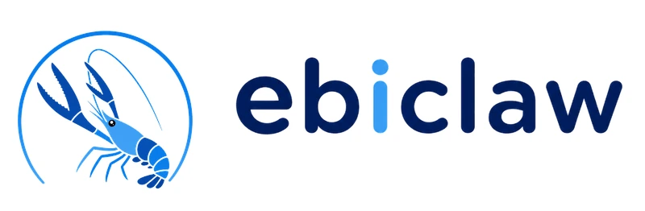

<div align="center">


<h1>PicoClaw: Ultra-Efficient AI Assistant in Go</h1>

<h3>$10 Hardware · 10MB RAM · ms Boot · Let's Go, PicoClaw!</h3>
  <p>
    
    
    
  </p>

[日本語](README.ja.md) | **English**

</div>

---

**PicoClaw** is an ultra-lightweight personal AI assistant written in **Go**. It runs on $10 hardware with <10MB RAM.

## ✨ Features

🪶 **Ultra-lightweight**: Core memory footprint <10MB.

💰 **Minimal cost**: Efficient enough to run on $10 hardware.

⚡️ **Lightning-fast boot**: Boots in <1s even on a 0.6GHz single-core processor.

🌍 **Truly portable**: Single binary across RISC-V, ARM, MIPS, and x86 architectures.

🔌 **MCP support**: Native [Model Context Protocol](https://modelcontextprotocol.io/) integration — connect any MCP server to extend Agent capabilities.

👁️ **Vision pipeline**: Send images and files directly to the Agent — automatic base64 encoding for multimodal LLMs.

🧠 **Smart routing**: Rule-based model routing — simple queries go to lightweight models, saving API costs.

> **[Hardware Compatibility List](docs/hardware-compatibility.md)** — See all tested boards, from $5 RISC-V to Raspberry Pi to Android phones.

## 📦 Install

### Download precompiled binary

Download the binary for your platform from the [GitHub Releases](https://github.com/n-seiji/ebiclaw/releases) page.

### Build from source

```bash
git clone https://github.com/n-seiji/ebiclaw.git

cd ebiclaw
mise run deps

# Build core binary
mise run build

# Build Web UI Launcher (required for WebUI mode)
mise run build-launcher

# Build for multiple platforms
mise run build-all

# Build for Raspberry Pi Zero 2 W (32-bit: mise run build-linux-arm; 64-bit: mise run build-linux-arm64)
mise run build-pi-zero

# Build and install
mise run install
```

**Raspberry Pi Zero 2 W:** Use the binary that matches your OS: 32-bit Raspberry Pi OS -> `mise run build-linux-arm`; 64-bit -> `mise run build-linux-arm64`. Or run `mise run build-pi-zero` to build both.

## 🚀 Quick Start Guide

### 🌐 WebUI Launcher (Recommended for Desktop)

The WebUI Launcher provides a browser-based interface for configuration and chat.

**Command line:**

```bash
picoclaw-launcher
# Open http://localhost:18800 in your browser
```

> [!TIP]
> **Remote access / Docker / VM:** Add the `-public` flag to listen on all interfaces:
> ```bash
> picoclaw-launcher -public
> ```

<p align="center">

</p>

**Getting started:** 

Open the WebUI, then: **1)** Configure a Provider (add your LLM API key) -> **2)** Configure a Channel (e.g., Discord) -> **3)** Start the Gateway -> **4)** Chat!

<details>
<summary><b>Docker (alternative)</b></summary>

```bash
# 1. Clone this repo
git clone https://github.com/n-seiji/ebiclaw.git
cd ebiclaw

# 2. First run — auto-generates docker/data/config.json then exits
#    (only triggers when both config.json and workspace/ are missing)
docker compose -f docker/docker-compose.yml --profile launcher up
# The container prints "First-run setup complete." and stops.

# 3. Set your API keys
vim docker/data/config.json

# 4. Start
docker compose -f docker/docker-compose.yml --profile launcher up -d
# Open http://localhost:18800
```

> **Docker / VM users:** The Gateway listens on `127.0.0.1` by default. Set `PICOCLAW_GATEWAY_HOST=0.0.0.0` or use the `-public` flag to make it accessible from the host.

```bash
# Check logs
docker compose -f docker/docker-compose.yml logs -f

# Stop
docker compose -f docker/docker-compose.yml --profile launcher down

# Update
docker compose -f docker/docker-compose.yml pull
docker compose -f docker/docker-compose.yml --profile launcher up -d
```

</details>

<details>
<summary><b>macOS — First Launch Security Warning</b></summary>

macOS may block `picoclaw-launcher` on first launch because it is downloaded from the internet and not notarized through the Mac App Store.

**Step 1:** Double-click `picoclaw-launcher`. You will see a security warning:

<p align="center">

</p>

> *"picoclaw-launcher" Not Opened — Apple could not verify "picoclaw-launcher" is free of malware that may harm your Mac or compromise your privacy.*

**Step 2:** Open **System Settings** → **Privacy & Security** → scroll down to the **Security** section → click **Open Anyway** → confirm by clicking **Open Anyway** in the dialog.

<p align="center">

</p>

After this one-time step, `picoclaw-launcher` will open normally on subsequent launches.

</details>

### 💻 TUI Launcher (Recommended for Headless / SSH)

The TUI (Terminal UI) Launcher provides a full-featured terminal interface for configuration and management. Ideal for servers, Raspberry Pi, and other headless environments.

```bash
picoclaw-launcher-tui
```

<p align="center">

</p>

**Getting started:** 

Use the TUI menus to: **1)** Configure a Provider -> **2)** Configure a Channel -> **3)** Start the Gateway -> **4)** Chat!

### 💻 Terminal Launcher

For minimal environments where only the `picoclaw` core binary is available (no Launcher UI), you can configure everything via the command line and a JSON config file.

**1. Initialize**

```bash
picoclaw onboard
```

This creates `~/.picoclaw/config.json` and the workspace directory.

**2. Configure** (`~/.picoclaw/config.json`)

```json
{
  "agents": {
    "defaults": {
      "model_name": "gpt-5.4"
    }
  },
  "model_list": [
    {
      "model_name": "gpt-5.4",
      "model": "openai/gpt-5.4"
      // api_key is now loaded from .security.yml
    }
  ]
}
```

> See `config/config.example.json` in the repo for a complete configuration template with all available options.
> 
> Please note: config.example.json format is version 0, with sensitive codes in it, and will be auto migrated to version 1+, then, the config.json will only store insensitive data, the sensitive codes will be stored in .security.yml, if you need manually modify the codes, please see `docs/security_configuration.md` for more details.


**3. Chat**

```bash
# One-shot question
picoclaw agent -m "What is 2+2?"

# Interactive mode
picoclaw agent

# Start gateway for chat app integration
picoclaw gateway
```

## 🔌 Providers (LLM)

PicoClaw supports multiple LLM providers through the `model_list` configuration. Use the `protocol/model` format:

| Provider | Protocol | API Key | Notes |
|----------|----------|---------|-------|
| [OpenAI](https://platform.openai.com/api-keys) | `openai/` | Required | GPT-5.4, GPT-4o, o3, etc. |
| [Anthropic](https://console.anthropic.com/settings/keys) | `anthropic/` | Required | Claude Opus 4.6, Sonnet 4.6, etc. |
| [Google Gemini](https://aistudio.google.com/apikey) | `gemini/` | Required | Gemini 3 Flash, 2.5 Pro, etc. |
| [OpenRouter](https://openrouter.ai/keys) | `openrouter/` | Required | 200+ models, unified API |
| [DeepSeek](https://platform.deepseek.com/api_keys) | `deepseek/` | Required | DeepSeek-V3, DeepSeek-R1 |
| [Groq](https://console.groq.com/keys) | `groq/` | Required | Fast inference (Llama, Mixtral) |
| [Mistral](https://console.mistral.ai/api-keys) | `mistral/` | Required | Mistral Large, Codestral |
| [Ollama](https://ollama.com/) | `ollama/` | Not needed | Local models, self-hosted |
| [vLLM](https://docs.vllm.ai/) | `vllm/` | Not needed | Local deployment, OpenAI-compatible |
| [LiteLLM](https://docs.litellm.ai/) | `litellm/` | Varies | Proxy for 100+ providers |
| [GitHub Copilot](https://github.com/features/copilot) | `github-copilot/` | OAuth | Device code login |
| [AWS Bedrock](https://console.aws.amazon.com/bedrock)* | `bedrock/` | AWS credentials | Claude, Llama, Mistral on AWS |

> \* AWS Bedrock requires build tag: `go build -tags bedrock`. Set `api_base` to a region name (e.g., `us-east-1`) for automatic endpoint resolution across all AWS partitions (aws, aws-cn, aws-us-gov). When using a full endpoint URL instead, you must also configure `AWS_REGION` via environment variable or AWS config/profile.

<details>
<summary><b>Local deployment (Ollama, vLLM, etc.)</b></summary>

**Ollama:**
```json
{
  "model_list": [
    {
      "model_name": "local-llama",
      "model": "ollama/llama3.1:8b",
      "api_base": "http://localhost:11434/v1"
    }
  ]
}
```

**vLLM:**
```json
{
  "model_list": [
    {
      "model_name": "local-vllm",
      "model": "vllm/your-model",
      "api_base": "http://localhost:8000/v1"
    }
  ]
}
```

For full provider configuration details, see [Providers & Models](docs/providers.md).

</details>

## 💬 Channels (Chat Apps)

Talk to your PicoClaw through messaging platforms:

| Channel | Setup | Protocol | Docs |
|---------|-------|----------|------|
| **Discord** | Easy (bot token + intents) | WebSocket | [Guide](docs/channels/discord/README.md) |
| **Slack** | Easy (bot + app token) | Socket Mode | [Guide](docs/channels/slack/README.md) |
| **Pico** | Easy (enable) | Native protocol | Built-in |
| **Pico Client** | Easy (WebSocket URL) | WebSocket | Built-in |

> Log verbosity is controlled by `gateway.log_level` (default: `warn`). Supported values: `debug`, `info`, `warn`, `error`, `fatal`. Can also be set via `PICOCLAW_LOG_LEVEL`. See [Configuration](docs/configuration.md#gateway-log-level) for details.

For detailed channel setup instructions, see [Chat Apps Configuration](docs/chat-apps.md).

## 🔧 Tools

### 🔍 Web Search

PicoClaw can search the web to provide up-to-date information. Configure in `tools.web`:

| Search Engine | API Key | Free Tier | Link |
|--------------|---------|-----------|------|
| DuckDuckGo | Not needed | Unlimited | Built-in fallback |
| [Tavily](https://tavily.com) | Required | 1000 queries/month | Optimized for AI Agents |
| [Brave Search](https://brave.com/search/api) | Required | 2000 queries/month | Fast and private |
| [Perplexity](https://www.perplexity.ai) | Required | Paid | AI-powered search |
| [SearXNG](https://github.com/searxng/searxng) | Not needed | Self-hosted | Free metasearch engine |

### ⚙️ Other Tools

PicoClaw includes built-in tools for file operations, code execution, scheduling, and more. See [Tools Configuration](docs/tools_configuration.md) for details.

## 🎯 Skills

Skills are modular capabilities that extend your Agent. They are loaded from `SKILL.md` files in your workspace.

## 🔗 MCP (Model Context Protocol)

PicoClaw natively supports [MCP](https://modelcontextprotocol.io/) — connect any MCP server to extend your Agent's capabilities with external tools and data sources.

```json
{
  "tools": {
    "mcp": {
      "enabled": true,
      "servers": {
        "filesystem": {
          "enabled": true,
          "command": "npx",
          "args": ["-y", "@modelcontextprotocol/server-filesystem", "/tmp"]
        }
      }
    }
  }
}
```

For full MCP configuration (stdio, SSE, HTTP transports, Tool Discovery), see [Tools Configuration - MCP](docs/tools_configuration.md#mcp-tool).

## 🖥️ CLI Reference

| Command                   | Description                      |
| ------------------------- | -------------------------------- |
| `picoclaw onboard`        | Initialize config & workspace    |
| `picoclaw agent -m "..."` | Chat with the agent              |
| `picoclaw agent`          | Interactive chat mode            |
| `picoclaw gateway`        | Start the gateway                |
| `picoclaw status`         | Show status                      |
| `picoclaw version`        | Show version info                |
| `picoclaw model`          | View or switch the default model |
| `picoclaw cron list`      | List all scheduled jobs          |
| `picoclaw cron add ...`   | Add a scheduled job              |
| `picoclaw cron disable`   | Disable a scheduled job          |
| `picoclaw cron remove`    | Remove a scheduled job           |
| `picoclaw skills list`    | List installed skills            |
| `picoclaw skills install` | Install a skill                  |
| `picoclaw migrate`        | Migrate data from older versions |
| `picoclaw auth login`     | Authenticate with providers      |

### ⏰ Scheduled Tasks / Reminders

PicoClaw supports scheduled reminders and recurring tasks through the `cron` tool:

* **One-time reminders**: "Remind me in 10 minutes" -> triggers once after 10min
* **Recurring tasks**: "Remind me every 2 hours" -> triggers every 2 hours
* **Cron expressions**: "Remind me at 9am daily" -> uses cron expression

See [docs/cron.md](docs/cron.md) for current schedule types, execution modes, command-job gates, and persistence details.

## 📚 Documentation

For detailed guides beyond this README:

| Topic | Description |
|-------|-------------|
| [Docker & Quick Start](docs/docker.md) | Docker Compose setup, Launcher/Agent modes |
| [Chat Apps](docs/chat-apps.md) | Channel setup guides |
| [Configuration](docs/configuration.md) | Environment variables, workspace layout, security sandbox |
| [Scheduled Tasks and Cron Jobs](docs/cron.md) | Cron schedule types, deliver modes, command gates, job storage |
| [Providers & Models](docs/providers.md) | LLM providers, model routing, model_list configuration |
| [Spawn & Async Tasks](docs/spawn-tasks.md) | Quick tasks, long tasks with spawn, async sub-agent orchestration |
| [Hooks](docs/hooks/README.md) | Event-driven hook system: observers, interceptors, approval hooks |
| [Steering](docs/steering.md) | Inject messages into a running agent loop between tool calls |
| [SubTurn](docs/subturn.md) | Subagent coordination, concurrency control, lifecycle |
| [Troubleshooting](docs/troubleshooting.md) | Common issues and solutions |
| [Tools Configuration](docs/tools_configuration.md) | Per-tool enable/disable, exec policies, MCP, Skills |
| [Hardware Compatibility](docs/hardware-compatibility.md) | Tested boards, minimum requirements |

## 🤝 Contribute

PRs welcome! See [CONTRIBUTING.md](CONTRIBUTING.md) for guidelines.
